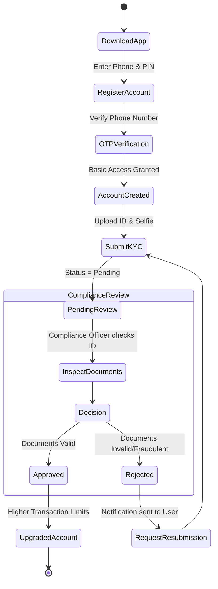
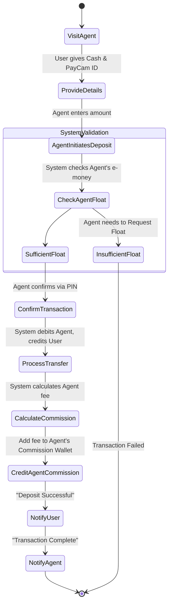
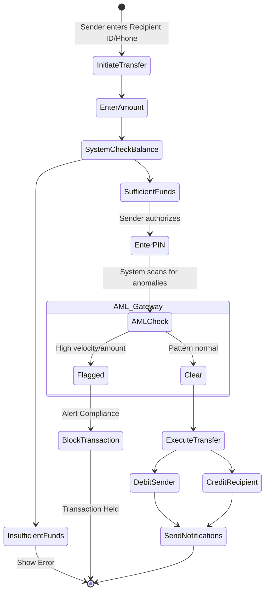
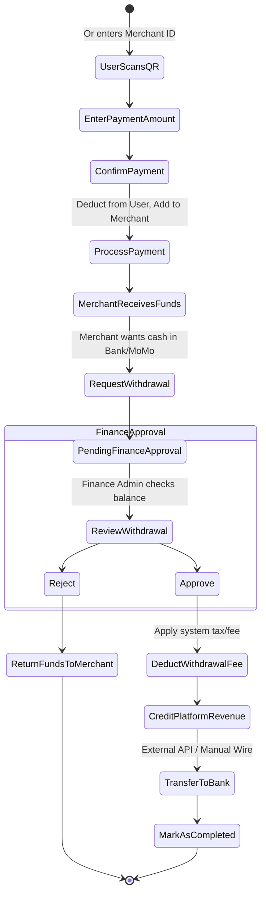

# PayCameroon Core Activity Diagrams

This document outlines the core activity flows within the PayCameroon system, detailing the step-by-step processes for the most critical user journeys.

## 1. User Registration & KYC Approval Flow

This activity diagram illustrates how a new user registers, submits their KYC documents, and how the Compliance team processes the application.

## 2. Cash-In (Deposit) Flow via Agent

This diagram details the physical-to-digital flow when a user visits an Agent to deposit cash into their PayCameroon wallet.

## 3. Peer-to-Peer (P2P) Transfer Flow

The standard process of one user sending money to another user.

## 4. Merchant Payment & Revenue Withdrawal Flow

How a user pays a merchant, and how the merchant cashes out their earnings.

## Description of the Core Activities

1. **KYC Flow**: Ensures regulatory compliance by forcing users to submit documents, which are manually reviewed by a Compliance Officer before lifting account restrictions.
2. **Cash-In Flow**: The critical link between physical cash and digital money. It involves the Agent's digital float, the user's receiving wallet, and the automated calculation and distribution of the Agent's commission.
3. **P2P Flow**: Highlights the seamless transfer of funds, but crucially includes the automated **AML (Anti-Money Laundering) Check** that intercepts the transaction if AI heuristics detect fraud.
4. **Merchant Flow**: Shows the end-to-end lifecycle of commercial money, from a user paying via QR code to the merchant requesting a corporate withdrawal, which requires Finance Admin approval and applies system taxes/fees.
