# PayCameroon Comprehensive Class Diagram

This document provides a detailed Class Diagram representing the core data models, entities, and their relationships within the PayCameroon system architecture. It reflects the structure of the underlying MongoDB (Mongoose) schemas used to drive the application.

```mermaid
classDiagram
    %% -------------------------
    %% CORE ENTITIES
    %% -------------------------
    class User {
        +String paycamId
        +String name
        +String phone
        +String pin
        +String password
        +Number balance
        +String role ["user", "agent", "merchant", "admin", "finance", "compliance", "support"]
        +String businessName
        +Boolean kycVerified
        +String status ["active", "frozen", "blocked"]
        +String language
        +Date createdAt
        +Date updatedAt
        +login()
        +updateProfile()
        +changePassword()
        +updateLanguage()
    }

    class Transaction {
        +String txId
        +String type ["p2p", "cash_in", "cash_out", "merchant_payment", "deposit", "withdrawal", "float_transfer", "service_payment"]
        +Number amount
        +Number fee
        +Number commission
        +String status ["pending", "completed", "failed", "reversed"]
        +Date timestamp
        +String description
        +processTransaction()
        +calculateFees()
        +reverseTransaction()
    }

    class KYCApplication {
        +String documentType
        +String documentUrl
        +String selfieUrl
        +String status ["pending", "approved", "rejected"]
        +String comments
        +Date submittedAt
        +Date reviewedAt
        +approve()
        +reject()
    }

    class AMLAlert {
        +String alertId
        +String ruleTriggered
        +String severity ["Low", "Medium", "High", "Critical"]
        +String description
        +String status ["open", "investigating", "resolved", "false_positive"]
        +Date createdAt
        +Date resolvedAt
        +investigate()
        +resolve()
    }

    class ApprovalRequest {
        +String requestId
        +String type ["float_request", "merchant_withdrawal"]
        +Number amount
        +String bankDetails
        +String status ["pending", "approved", "rejected"]
        +Date createdAt
        +Date processedAt
        +approveRequest()
        +rejectRequest()
    }

    class SupportTicket {
        +String ticketId
        +String subject
        +String status ["open", "in_progress", "closed"]
        +Date createdAt
        +Date updatedAt
        +addMessage()
        +closeTicket()
    }

    class ChatMessage {
        +String messageId
        +String content
        +Boolean isRead
        +Date timestamp
    }

    class Notification {
        +String notificationId
        +String title
        +String message
        +String type
        +Boolean isRead
        +Date createdAt
        +markAsRead()
    }

    class SystemSettings {
        +String logoUrl
        +Number taxRate
        +Number p2pFee
        +Number cashOutFee
        +Number agentCommissionRate
        +Number merchantCommissionRate
        +Object securityPolicies
        +updateSettings()
        +getRates()
    }

    class AuditLog {
        +String logId
        +String action
        +String category
        +String ipAddress
        +String details
        +Date timestamp
    }

    class InternalWallet {
        +String walletId
        +String name ["Treasury", "Revenue", "Commission"]
        +Number balance
        +String type
        +credit()
        +debit()
    }

    %% -------------------------
    %% RELATIONSHIPS
    %% -------------------------
    
    %% User relationships
    User "1" -- "0..*" Transaction : initiates (Sender)
    User "1" -- "0..*" Transaction : receives (Recipient)
    User "1" -- "0..1" KYCApplication : submits
    User "1" -- "0..*" AMLAlert : triggers
    User "1" -- "0..*" ApprovalRequest : creates
    User "1" -- "0..*" SupportTicket : opens
    User "1" -- "0..*" Notification : receives
    User "1" -- "0..*" AuditLog : performs action

    %% Multi-actor involvement in operations
    KYCApplication "0..*" -- "1" User : reviewed by (Compliance)
    AMLAlert "0..*" -- "1" User : resolved by (Compliance)
    ApprovalRequest "0..*" -- "1" User : processed by (Finance)
    SupportTicket "0..*" -- "1" User : assigned to (Support)
    
    %% Composition / Aggregation
    SupportTicket "1" *-- "1..*" ChatMessage : contains
    ChatMessage "0..*" -- "1" User : sent by
    
    %% System-wide elements
    Transaction "0..*" -- "1" SystemSettings : applies fees from
    ApprovalRequest "0..*" -- "1" InternalWallet : draws from / credits to
```

## Detailed Class Descriptions

1. **User**: The central entity representing all human actors in the system. The `role` attribute determines access control (Standard User, Agent, Merchant, Admin roles). Includes core authentication, balance holding, and profile management methods.
2. **Transaction**: Represents any movement of funds within the system. It tracks the sender, recipient, principal amount, applied system fees, and calculated agent/merchant commissions. State is managed via the `status` attribute.
3. **KYCApplication**: Stores compliance documentation submitted by standard users. Links to the submitting user and tracks the review status managed by Compliance Officers.
4. **AMLAlert**: System-generated objects triggered by the AI Threat Detection engine. Links to the flagged User/Transaction and tracks the investigation lifecycle.
5. **ApprovalRequest**: A generalized model handling requests that require manual authorization, primarily used for Agent Float Requests (drawing from Treasury) and Merchant Withdrawals.
6. **SupportTicket & ChatMessage**: Represents the PayChat architecture. A `SupportTicket` acts as the container/thread, while `ChatMessage` represents individual chat bubbles sent by the user or the support representative.
7. **Notification**: Push or in-app alerts generated by system events (e.g., successful transfer, KYC approved) linked directly to a target user.
8. **SystemSettings**: A singleton-like configuration object managed by the Super Admin. It dictates the global state of the application, including UI branding, taxation rates, and commission percentages applied during `Transaction.calculateFees()`.
9. **AuditLog**: Immutable records of critical administrative actions (e.g., blocking a user, changing system fees) for security and accountability tracking.
10. **InternalWallet**: Represents system-owned accounts (Treasury, Revenue, Commission pools) used to balance the global ledger and hold collected fees.
