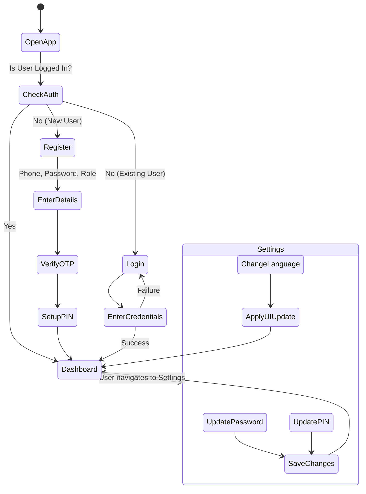
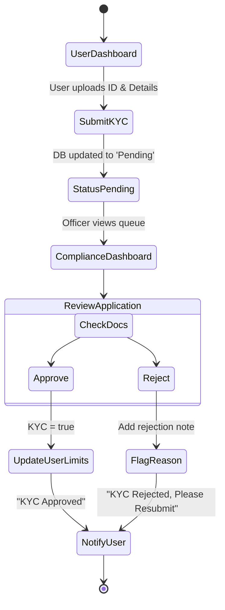
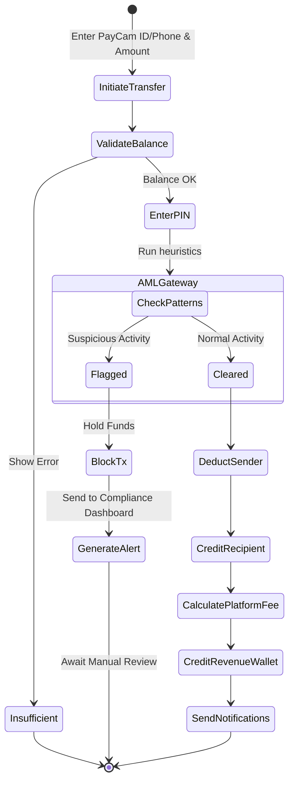
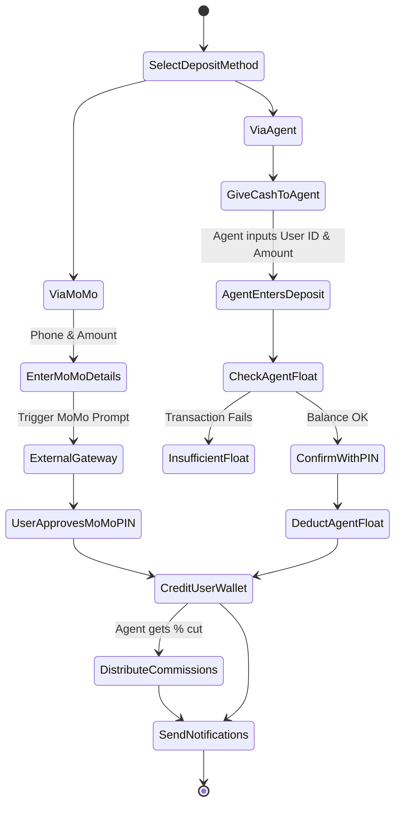
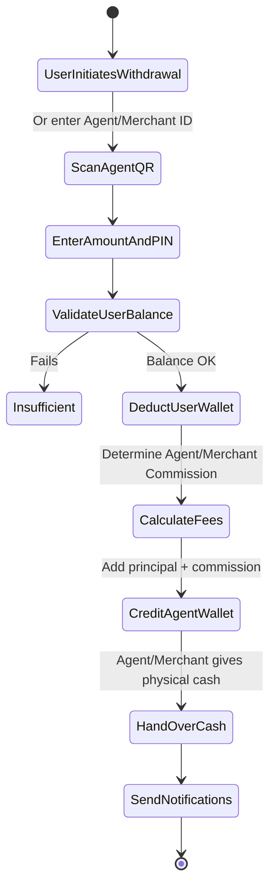
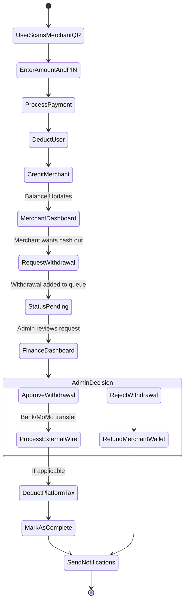
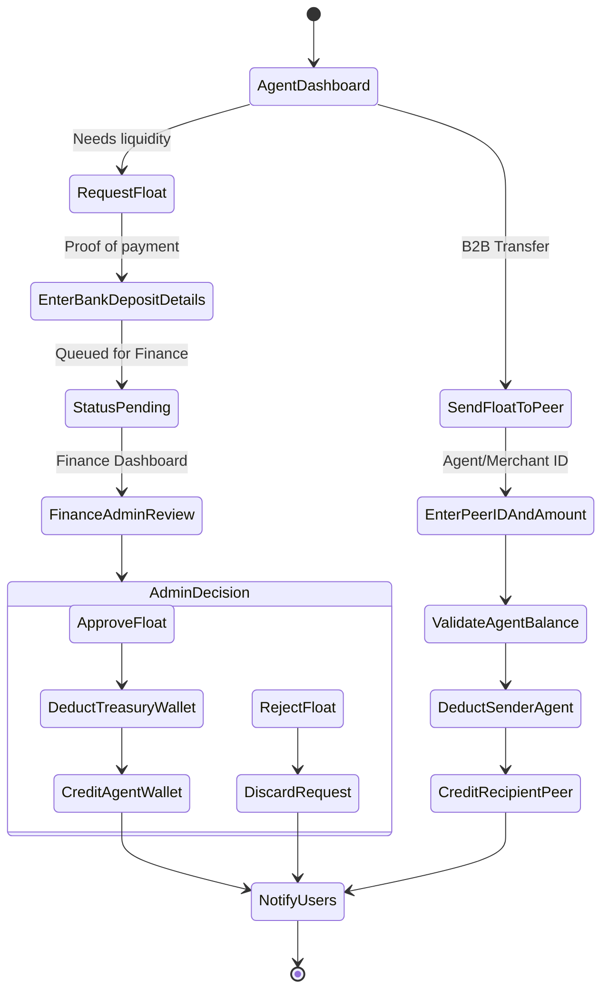
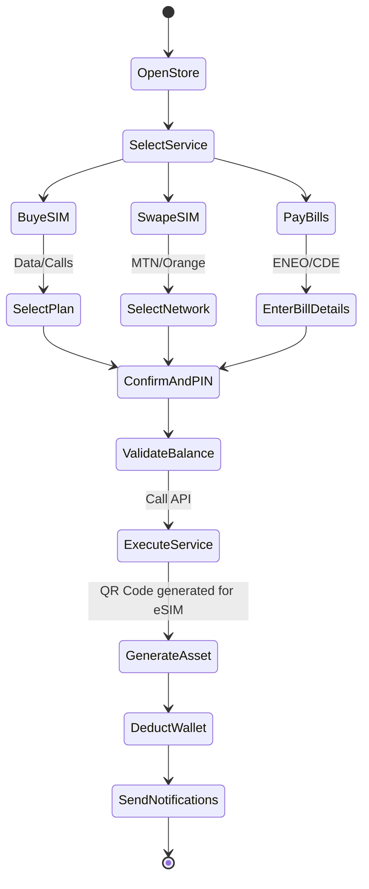
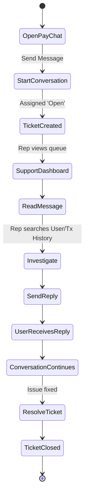
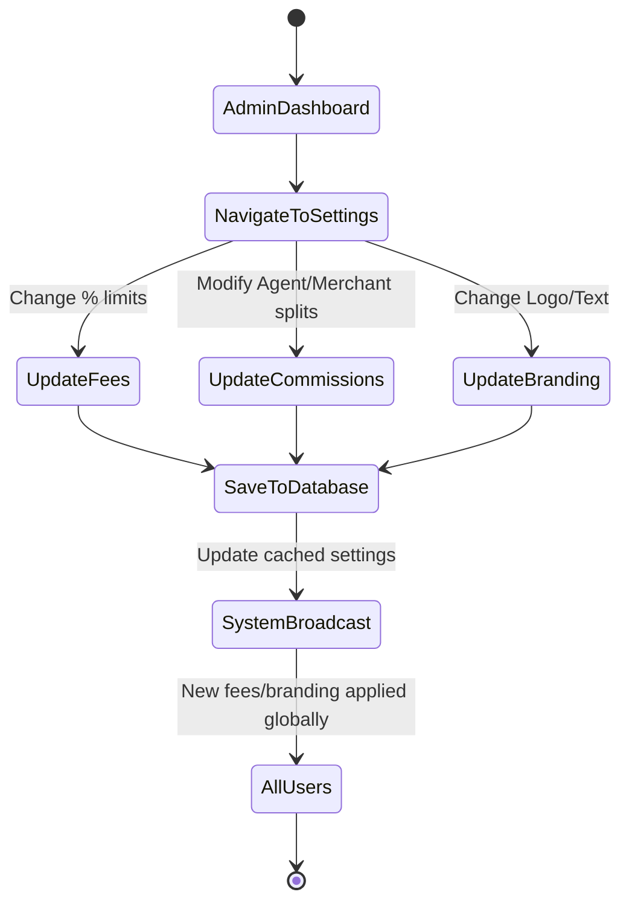

# PayCameroon Comprehensive Activity Diagrams

This document provides a complete set of activity diagrams detailing every functional workflow within the PayCameroon system. It maps the end-to-end journey of transactions, approvals, and system interactions across all user roles.

## 1. Authentication & Profile Management Flow

Describes the process of user registration, login, and managing personal settings (Password, PIN, Language).

## 2. KYC Submission & Compliance Review Flow

Describes how users submit compliance documents and how the Compliance Officer processes them.

## 3. Peer-to-Peer (P2P) Transfer & AML Flow

Describes the process of sending money between users, including the AI-driven Anti-Money Laundering (AML) checks.

## 4. Cash-In (Deposit) Flow via Agent or MoMo

Describes how a user adds funds to their digital wallet via an Agent or external Mobile Money provider.

## 5. Cash-Out (Withdrawal) Flow via Agent/Merchant

Describes how a user converts digital funds into physical cash through an Agent or Merchant.

## 6. Merchant Payment & Revenue Withdrawal Flow

Describes how merchants receive payments and request bank/MoMo withdrawals requiring Finance approval.

## 7. Agent Float Request & B2B Transfer Flow

Describes how Agents request digital float from the Treasury and how they can send float to other Agents/Merchants.

## 8. Store & Utility Services Flow

Describes purchasing eSIMs, swapping networks, or paying utility bills.

## 9. Support & PayChat System Flow

Describes how users/agents/merchants interact with support.

## 10. Super Admin System Configuration Flow

Describes how the Super Admin manages global platform variables.

