# PayCameroon Exhaustive Class Diagram & Data Dictionary

This document provides the complete, unsummarized Class Diagram for the entire PayCameroon system, followed by an exhaustive data dictionary detailing every single class, attribute, data type, method, and relationship without any omissions.

## 1. Complete System Class Diagram

```mermaid
classDiagram
    %% -------------------------
    %% ACTORS & CORE IDENTITIES
    %% -------------------------
    class User {
        +String _id
        +String paycamId
        +String name
        +String phone
        +String email
        +String passwordHash
        +String pinHash
        +Number balance
        +String role
        +String businessName
        +Boolean kycVerified
        +String status
        +String blockReason
        +Date blockedAt
        +String language
        +Date createdAt
        +Date updatedAt
        +authenticate(password: String): Boolean
        +verifyPIN(pin: String): Boolean
        +updateProfile(data: Object): User
        +updateLanguage(lang: String): void
        +freezeAccount(reason: String): void
        +unfreezeAccount(): void
    }

    class InternalWallet {
        +String _id
        +String name
        +String type
        +Number balance
        +String currency
        +Date lastUpdated
        +credit(amount: Number, reference: String): void
        +debit(amount: Number, reference: String): void
        +getBalance(): Number
    }

    class BankAccount {
        +String _id
        +String accountName
        +String accountNumber
        +String bankName
        +String swiftCode
        +String ownerId
        +String type
        +Boolean isActive
        +Date createdAt
    }

    %% -------------------------
    %% FINANCIAL TRANSACTIONS
    %% -------------------------
    class Transaction {
        +String _id
        +String txId
        +String senderId
        +String recipientId
        +String type
        +Number amount
        +Number systemFee
        +Number agentCommission
        +Number merchantCommission
        +String status
        +String description
        +String referenceId
        +Object metadata
        +Date timestamp
        +Date completedAt
        +process(): Boolean
        +calculateFees(amount: Number, type: String): Object
        +reverseTransaction(reason: String): Transaction
        +generateReceipt(): Object
    }

    class ApprovalRequest {
        +String _id
        +String requesterId
        +String type
        +Number amount
        +String bankAccountId
        +String status
        +String proofOfDepositUrl
        +String adminNotes
        +String processedBy
        +Date createdAt
        +Date processedAt
        +approve(adminId: String): Boolean
        +reject(adminId: String, reason: String): Boolean
    }

    %% -------------------------
    %% COMPLIANCE & SECURITY
    %% -------------------------
    class KYCApplication {
        +String _id
        +String userId
        +String documentType
        +String idNumber
        +String documentFrontUrl
        +String documentBackUrl
        +String selfieUrl
        +String status
        +String reviewedBy
        +String rejectionReason
        +Date submittedAt
        +Date reviewedAt
        +approveApplication(adminId: String): void
        +rejectApplication(adminId: String, reason: String): void
    }

    class AMLAlert {
        +String _id
        +String userId
        +String transactionId
        +String ruleTriggered
        +String severity
        +String description
        +String status
        +String investigatingOfficerId
        +String resolutionNotes
        +Date createdAt
        +Date resolvedAt
        +assignOfficer(adminId: String): void
        +resolveAlert(notes: String): void
        +escalateToBlock(): void
    }

    class AuditLog {
        +String _id
        +String adminId
        +String targetId
        +String action
        +String category
        +String ipAddress
        +String userAgent
        +Object previousState
        +Object newState
        +String details
        +Date timestamp
        +generateReport(dateRange: Object): Array
    }

    %% -------------------------
    %% COMMUNICATION & SUPPORT
    %% -------------------------
    class SupportTicket {
        +String _id
        +String creatorId
        +String assignedTo
        +String subject
        +String category
        +String priority
        +String status
        +Date createdAt
        +Date updatedAt
        +Date closedAt
        +assignRep(repId: String): void
        +updateStatus(newStatus: String): void
        +closeTicket(): void
    }

    class ChatMessage {
        +String _id
        +String ticketId
        +String senderId
        +String content
        +String attachmentUrl
        +Boolean isRead
        +Date timestamp
        +markAsRead(): void
    }

    class Notification {
        +String _id
        +String userId
        +String title
        +String message
        +String type
        +String referenceId
        +Boolean isRead
        +Date createdAt
        +markAsRead(): void
        +sendPushNotification(): void
    }

    %% -------------------------
    %% SYSTEM CONFIGURATION
    %% -------------------------
    class SystemSettings {
        +String _id
        +String platformName
        +String logoUrl
        +String supportEmail
        +Number taxRate
        +Number p2pFeePercentage
        +Number p2pFeeFixed
        +Number cashOutFeePercentage
        +Number agentCommissionRate
        +Number merchantCommissionRate
        +Object amlThresholds
        +Boolean maintenanceMode
        +Date lastUpdated
        +String updatedBy
        +updateGlobalFees(fees: Object): void
        +updateCommissions(commissions: Object): void
        +toggleMaintenance(status: Boolean): void
    }

    class StoreProduct {
        +String _id
        +String name
        +String category
        +String provider
        +Number price
        +Boolean isAvailable
        +Object metadata
        +Date createdAt
        +purchase(userId: String): Transaction
        +updateAvailability(status: Boolean): void
    }

    %% -------------------------
    %% RELATIONSHIPS
    %% -------------------------
    User "1" -- "0..*" Transaction : initiates (senderId)
    User "1" -- "0..*" Transaction : receives (recipientId)
    User "1" -- "0..1" KYCApplication : submits (userId)
    User "1" -- "0..*" AMLAlert : triggers (userId)
    User "1" -- "0..*" ApprovalRequest : creates (requesterId)
    User "1" -- "0..*" SupportTicket : opens (creatorId)
    User "1" -- "0..*" Notification : receives (userId)
    User "1" -- "0..*" BankAccount : owns (ownerId)
    
    SupportTicket "1" *-- "1..*" ChatMessage : contains (ticketId)
    ChatMessage "0..*" -- "1" User : sent by (senderId)
    
    AMLAlert "0..1" -- "1" Transaction : flags (transactionId)
    
    AuditLog "0..*" -- "1" User : tracks admin action (adminId)
    
    SystemSettings "1" -- "0..*" Transaction : governs fees
    
    ApprovalRequest "0..*" -- "1" InternalWallet : draws from / credits to
    ApprovalRequest "0..*" -- "0..1" BankAccount : deposits to (bankAccountId)

    StoreProduct "1" -- "0..*" Transaction : purchased via (referenceId)
```

---

## 2. Exhaustive Data Dictionary (All Classes, Attributes, and Methods)

### 2.1 User
Represents every human or business entity operating on the platform (Standard Users, Agents, Merchants, Admins, Finance, Compliance, Support).
*   **Attributes:**
    *   `_id` (String / ObjectId): Primary key generated by the database.
    *   `paycamId` (String): Unique, user-facing system identifier (e.g., PC-847291).
    *   `name` (String): Full legal name of the individual or account holder.
    *   `phone` (String): Unique mobile number used for login and identity verification.
    *   `email` (String, Optional): Email address for receipts and recovery.
    *   `passwordHash` (String): Bcrypt-hashed password for web portal access.
    *   `pinHash` (String): Bcrypt-hashed 4-digit PIN required to authorize all financial transactions.
    *   `balance` (Number): The exact floating-point value of e-money available in the user's digital wallet.
    *   `role` (String): Enum `['user', 'agent', 'merchant', 'admin', 'finance', 'compliance', 'support']`. Defines RBAC (Role-Based Access Control) permissions.
    *   `businessName` (String, Optional): The registered trading name if the role is `merchant` or `agent`.
    *   `kycVerified` (Boolean): Master flag defining if the user has passed identity verification. Determines transaction limits.
    *   `status` (String): Enum `['active', 'frozen', 'blocked']`.
    *   `blockReason` (String, Optional): Explanation logged by compliance if the account is frozen/blocked.
    *   `blockedAt` (Date, Optional): Timestamp of when the account was restricted.
    *   `language` (String): Localization preference (e.g., `en`, `fr`).
    *   `createdAt` / `updatedAt` (Date): System audit timestamps.
*   **Methods:**
    *   `authenticate(password: String): Boolean`: Compares plain-text password against `passwordHash`.
    *   `verifyPIN(pin: String): Boolean`: Compares plain-text PIN against `pinHash`.
    *   `updateProfile(data: Object): User`: Mutates name, email, or language.
    *   `updateLanguage(lang: String): void`: Updates UI language setting.
    *   `freezeAccount(reason: String): void`: Changes status to `frozen` and logs reason.
    *   `unfreezeAccount(): void`: Restores status to `active`.

### 2.2 InternalWallet
System-owned ledger accounts used to hold corporate funds, collected fees, and reserve liquidity.
*   **Attributes:**
    *   `_id` (String / ObjectId): Primary key.
    *   `name` (String): Human-readable name (e.g., "Central Treasury", "Revenue Pool", "Agent Commission Reserve").
    *   `type` (String): Enum `['treasury', 'revenue', 'commission']`.
    *   `balance` (Number): Total accumulated funds in this ledger.
    *   `currency` (String): Base currency (e.g., "XAF").
    *   `lastUpdated` (Date): Timestamp of the last credit/debit.
*   **Methods:**
    *   `credit(amount: Number, reference: String): void`: Increases balance and logs reference.
    *   `debit(amount: Number, reference: String): void`: Decreases balance and logs reference. Throws error if insufficient.
    *   `getBalance(): Number`: Returns current float.

### 2.3 BankAccount
External banking details mapped to Users (Merchants withdrawing funds) or the System (Treasury accounts for Agents to deposit into).
*   **Attributes:**
    *   `_id` (String / ObjectId): Primary key.
    *   `accountName` (String): Name on the bank account.
    *   `accountNumber` (String): Routing or account number (or Mobile Money number).
    *   `bankName` (String): Institution name (e.g., "Afriland First Bank", "MTN Mobile Money").
    *   `swiftCode` (String, Optional): International routing code.
    *   `ownerId` (String): Foreign key to the `User` or "SYSTEM".
    *   `type` (String): Enum `['corporate', 'personal', 'momo']`.
    *   `isActive` (Boolean): Whether the account is currently enabled for routing.
    *   `createdAt` (Date): Creation timestamp.

### 2.4 Transaction
The atomic, immutable ledger entry for every financial movement.
*   **Attributes:**
    *   `_id` (String / ObjectId): Primary key.
    *   `txId` (String): Unique transaction hash presented to users (e.g., TXN-92837492A).
    *   `senderId` (String): Foreign key to the `User` or `InternalWallet` initiating the send.
    *   `recipientId` (String): Foreign key to the `User` or `InternalWallet` receiving the funds.
    *   `type` (String): Enum `['p2p', 'cash_in', 'cash_out', 'merchant_payment', 'deposit', 'withdrawal', 'float_transfer', 'service_payment']`.
    *   `amount` (Number): The principal amount being transferred.
    *   `systemFee` (Number): Amount deducted as platform tax/revenue.
    *   `agentCommission` (Number): Cut awarded to the facilitating agent (if applicable).
    *   `merchantCommission` (Number): Cut awarded to the facilitating merchant (if applicable).
    *   `status` (String): Enum `['pending', 'completed', 'failed', 'reversed']`.
    *   `description` (String): System-generated human-readable description.
    *   `referenceId` (String, Optional): Foreign key linking to an external API reference or Store Product ID.
    *   `metadata` (Object): JSON object holding dynamic data (e.g., device IP, geolocation, eSIM ICCID).
    *   `timestamp` (Date): Exact time of initiation.
    *   `completedAt` (Date): Exact time of final settlement.
*   **Methods:**
    *   `process(): Boolean`: Executes the ACID transaction logic across wallets using database sessions/locks.
    *   `calculateFees(amount: Number, type: String): Object`: Queries `SystemSettings` to populate fee and commission fields before processing.
    *   `reverseTransaction(reason: String): Transaction`: Creates a counter-transaction to refund amounts and fees.
    *   `generateReceipt(): Object`: Outputs a structured JSON receipt for the frontend.

### 2.5 ApprovalRequest
Workflow object for handling requests that require manual Finance Administration authorization.
*   **Attributes:**
    *   `_id` (String / ObjectId): Primary key.
    *   `requesterId` (String): Foreign key to the Agent (Float Request) or Merchant (Withdrawal).
    *   `type` (String): Enum `['float_request', 'merchant_withdrawal']`.
    *   `amount` (Number): Requested value.
    *   `bankAccountId` (String, Optional): The destination bank account for Merchant Withdrawals.
    *   `status` (String): Enum `['pending', 'approved', 'rejected']`.
    *   `proofOfDepositUrl` (String, Optional): Storage link to an uploaded bank receipt (used by Agents proving they paid the treasury).
    *   `adminNotes` (String): Explanation left by Finance admin.
    *   `processedBy` (String): Foreign key to the Finance Admin who handled the request.
    *   `createdAt` (Date): Time requested.
    *   `processedAt` (Date): Time resolved.
*   **Methods:**
    *   `approve(adminId: String): Boolean`: Triggers the ledger movement (e.g., moving money from `InternalWallet` to Agent's `User.balance`), sets status to approved.
    *   `reject(adminId: String, reason: String): Boolean`: Sets status to rejected and populates `adminNotes`.

### 2.6 KYCApplication
Compliance documentation submitted by users to lift transaction limits.
*   **Attributes:**
    *   `_id` (String / ObjectId): Primary key.
    *   `userId` (String): Foreign key to the User.
    *   `documentType` (String): e.g., "National ID", "Passport", "Driver's License".
    *   `idNumber` (String): Extracted or manually entered ID sequence.
    *   `documentFrontUrl` (String): Storage pointer to the front image.
    *   `documentBackUrl` (String): Storage pointer to the back image.
    *   `selfieUrl` (String): Storage pointer to the liveness check image.
    *   `status` (String): Enum `['pending', 'approved', 'rejected']`.
    *   `reviewedBy` (String): Foreign key to the Compliance Admin.
    *   `rejectionReason` (String, Optional): Reason provided to the user upon failure.
    *   `submittedAt` / `reviewedAt` (Date): Lifecycle timestamps.
*   **Methods:**
    *   `approveApplication(adminId: String): void`: Updates status and toggles `User.kycVerified = true`.
    *   `rejectApplication(adminId: String, reason: String): void`: Updates status, notifies user.

### 2.7 AMLAlert
Flags generated automatically by AI models or heuristic rules monitoring the transaction stream.
*   **Attributes:**
    *   `_id` (String / ObjectId): Primary key.
    *   `userId` (String): Foreign key to the User behaving suspiciously.
    *   `transactionId` (String, Optional): Foreign key to the specific triggering transaction.
    *   `ruleTriggered` (String): Name of the rule (e.g., "Structuring Anomaly", "High Velocity P2P").
    *   `severity` (String): Enum `['Low', 'Medium', 'High', 'Critical']`.
    *   `description` (String): Detailed text generated by the AI detailing *why* it flagged the action.
    *   `status` (String): Enum `['open', 'investigating', 'resolved', 'false_positive']`.
    *   `investigatingOfficerId` (String, Optional): Foreign key to the assigned Compliance Admin.
    *   `resolutionNotes` (String, Optional): Manual notes entered when closing the alert.
    *   `createdAt` / `resolvedAt` (Date): Lifecycle timestamps.
*   **Methods:**
    *   `assignOfficer(adminId: String): void`: Claims the ticket for a specific admin.
    *   `resolveAlert(notes: String): void`: Closes the alert.
    *   `escalateToBlock(): void`: Immediately triggers `User.freezeAccount()`.

### 2.8 AuditLog
Immutable security and accountability trail for all administrative actions.
*   **Attributes:**
    *   `_id` (String / ObjectId): Primary key.
    *   `adminId` (String): Foreign key to the Admin performing the action.
    *   `targetId` (String, Optional): Foreign key to the Entity being modified (e.g., a User ID, a Setting ID).
    *   `action` (String): Precise description (e.g., "UPDATE_GLOBAL_FEE", "BLOCK_USER", "APPROVE_FLOAT").
    *   `category` (String): Enum `['security', 'finance', 'compliance', 'system_config']`.
    *   `ipAddress` (String): Network origin of the admin request.
    *   `userAgent` (String): Browser/device data of the admin.
    *   `previousState` (Object, Optional): JSON snapshot of the data *before* the change.
    *   `newState` (Object, Optional): JSON snapshot of the data *after* the change.
    *   `details` (String): Human-readable summary.
    *   `timestamp` (Date): Exact time of action.
*   **Methods:**
    *   `generateReport(dateRange: Object): Array`: Queries and exports logs for external auditing.

### 2.9 SupportTicket & ChatMessage
The underlying data structures for the "PayChat" unified support system.
*   **SupportTicket Attributes:**
    *   `_id` (String / ObjectId): Primary key.
    *   `creatorId` (String): Foreign key to the User/Agent/Merchant.
    *   `assignedTo` (String, Optional): Foreign key to the Support Rep.
    *   `subject` (String): Topic of the ticket.
    *   `category` (String): Enum `['transaction_issue', 'account_access', 'kyc_help', 'bug_report', 'other']`.
    *   `priority` (String): Enum `['low', 'normal', 'urgent']`.
    *   `status` (String): Enum `['open', 'in_progress', 'waiting_on_user', 'closed']`.
    *   `createdAt` / `updatedAt` / `closedAt` (Date): Timestamps.
*   **SupportTicket Methods:**
    *   `assignRep(repId: String): void`
    *   `updateStatus(newStatus: String): void`
    *   `closeTicket(): void`
*   **ChatMessage Attributes:**
    *   `_id` (String / ObjectId): Primary key.
    *   `ticketId` (String): Foreign key linking to the parent `SupportTicket`.
    *   `senderId` (String): Foreign key to the User or Support Rep who typed the message.
    *   `content` (String): The text payload.
    *   `attachmentUrl` (String, Optional): Link to an uploaded image/screenshot.
    *   `isRead` (Boolean): Read receipt status.
    *   `timestamp` (Date): Time sent.
*   **ChatMessage Methods:**
    *   `markAsRead(): void`

### 2.10 Notification
System alerts dispatched to users across all roles.
*   **Attributes:**
    *   `_id` (String / ObjectId): Primary key.
    *   `userId` (String): Target recipient.
    *   `title` (String): Short header (e.g., "Funds Received").
    *   `message` (String): Full body text.
    *   `type` (String): Enum `['transaction', 'security', 'system', 'support', 'marketing']`.
    *   `referenceId` (String, Optional): Link to a related entity (e.g., a Transaction ID or Ticket ID).
    *   `isRead` (Boolean): Toggled when user views the alert.
    *   `createdAt` (Date): Time dispatched.
*   **Methods:**
    *   `markAsRead(): void`
    *   `sendPushNotification(): void`: Triggers external Firebase/APNS services.

### 2.11 SystemSettings
A global configuration document (usually restricted to a single record in the DB) managed by the Super Admin to control platform behavior dynamically without code deployments.
*   **Attributes:**
    *   `_id` (String / ObjectId): Primary key.
    *   `platformName` (String): Global application name.
    *   `logoUrl` (String): URL pointing to the primary branding asset.
    *   `supportEmail` (String): Public contact email.
    *   `taxRate` (Number): Percentage tax applied globally to taxable events.
    *   `p2pFeePercentage` (Number): Percentage fee taken on user-to-user transfers.
    *   `p2pFeeFixed` (Number): Flat flat taken on user-to-user transfers.
    *   `cashOutFeePercentage` (Number): Percentage fee taken when users withdraw physical cash.
    *   `agentCommissionRate` (Number): Percentage of the `cashOutFee` that is routed to the Agent's commission wallet.
    *   `merchantCommissionRate` (Number): Percentage bonus awarded to Merchants for specific integrations.
    *   `amlThresholds` (Object): JSON configuration defining velocity limits and triggers for the AI engine (e.g., `{ maxDailyTransfer: 500000, maxVelocityPerMinute: 3 }`).
    *   `maintenanceMode` (Boolean): Master kill-switch to pause all financial transactions globally.
    *   `lastUpdated` (Date): Time of last modification.
    *   `updatedBy` (String): Foreign key to the Super Admin who made the last change.
*   **Methods:**
    *   `updateGlobalFees(fees: Object): void`: Saves new fee structures.
    *   `updateCommissions(commissions: Object): void`: Saves new splits.
    *   `toggleMaintenance(status: Boolean): void`: Enables/disables system access.

### 2.12 StoreProduct
Represents digital goods and services available for purchase directly within the app (eSIMs, Utility Bills).
*   **Attributes:**
    *   `_id` (String / ObjectId): Primary key.
    *   `name` (String): Product name (e.g., "MTN 5GB Data eSIM", "ENEO Postpaid Bill").
    *   `category` (String): Enum `['esim', 'utility', 'airtime', 'entertainment']`.
    *   `provider` (String): The external vendor (e.g., "Orange", "Camwater").
    *   `price` (Number): Fixed price, or `0` if it's a dynamic bill payment.
    *   `isAvailable` (Boolean): Toggled based on API upstream health.
    *   `metadata` (Object): JSON defining required user inputs (e.g., `requiresMeterNumber: true`).
    *   `createdAt` (Date): Time added to catalog.
*   **Methods:**
    *   `purchase(userId: String): Transaction`: Triggers a transaction, deducting balance and integrating with the external provider API to deliver the good.
    *   `updateAvailability(status: Boolean): void`: Temporarily disables the product.
