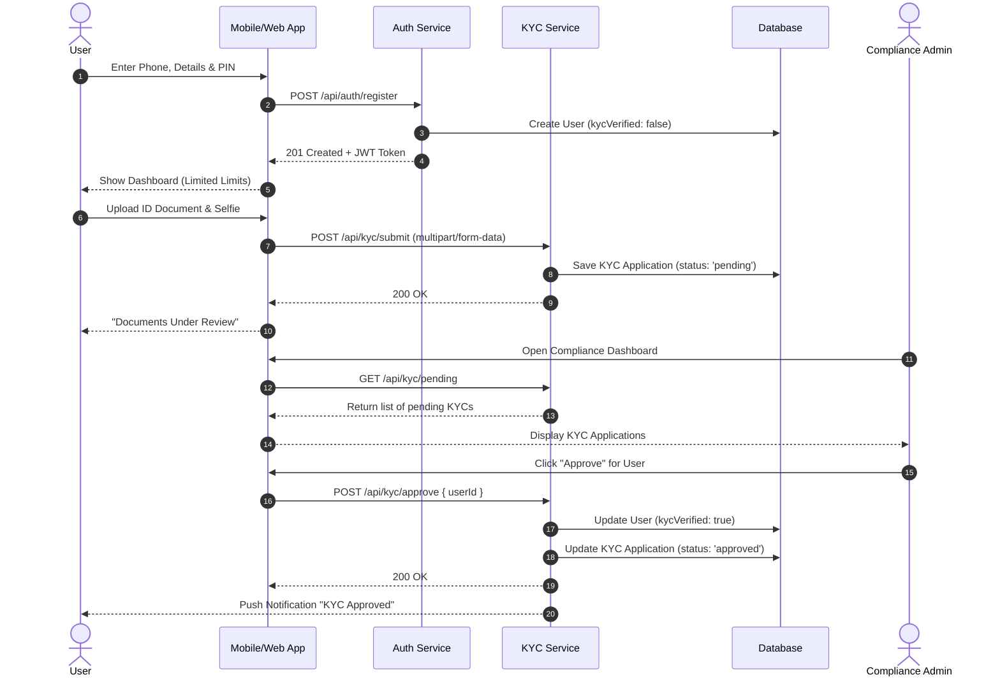
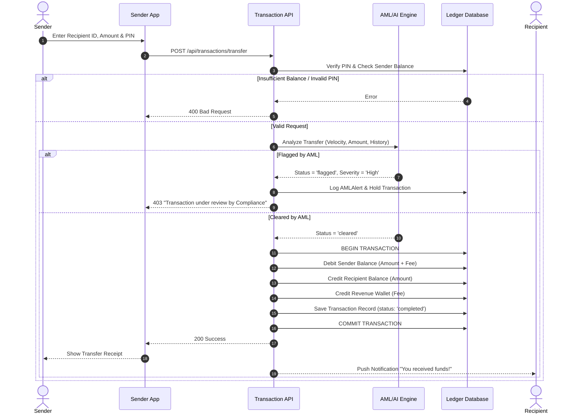
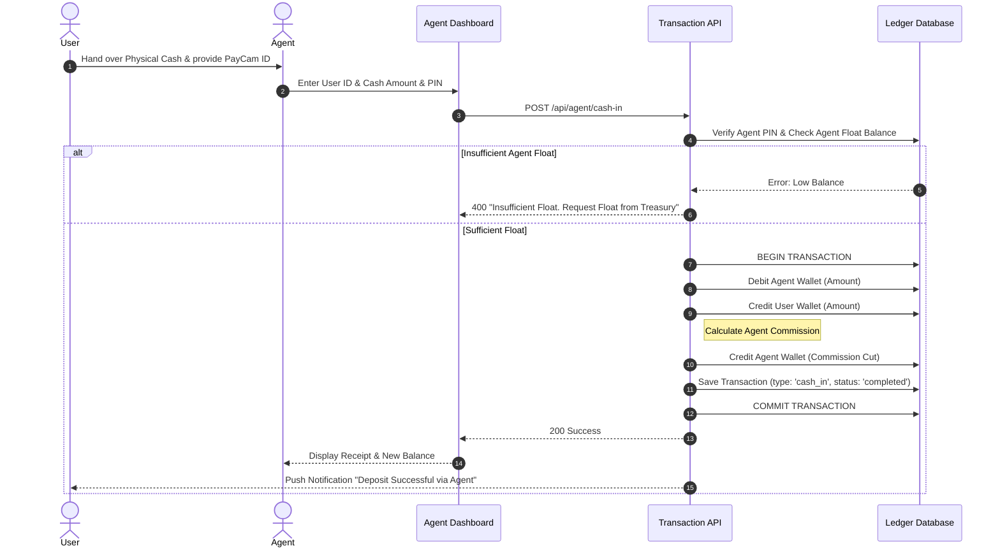
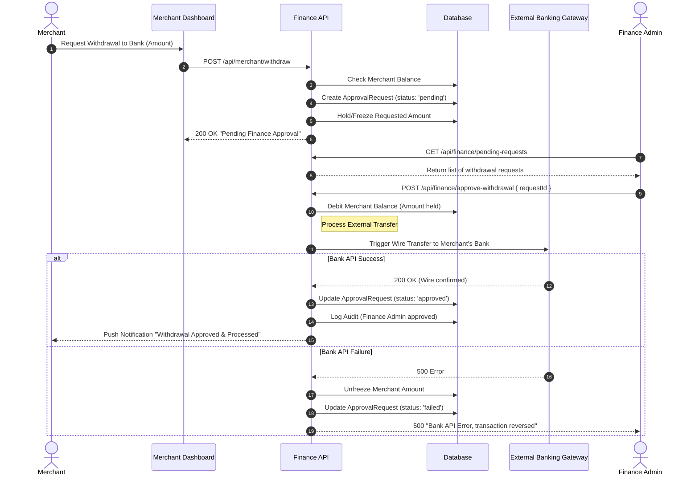
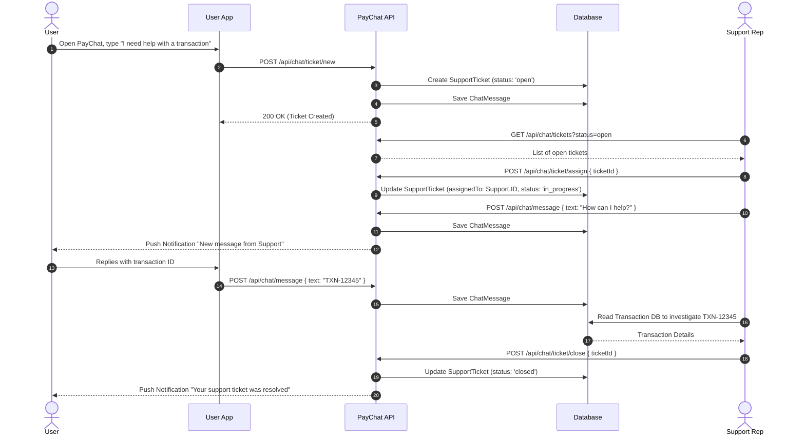

# PayCameroon System Sequence Diagrams

This document outlines the sequential flow of messages, data, and logic across the platform's actors and backend services for key operational workflows.

## 1. User Registration & KYC Approval Sequence

This sequence details how a user registers and gets their KYC documents verified by the Compliance team.

## 2. Peer-to-Peer (P2P) Transfer with AML Checking

This sequence illustrates a transfer between two users, highlighting the intervention of the AI-driven AML (Anti-Money Laundering) engine.

## 3. Agent Cash-In (Deposit) Sequence

The process of converting physical cash into digital e-money via an Agent.

## 4. Merchant Revenue Withdrawal Sequence

The workflow for a Merchant withdrawing their digital revenue into a physical corporate bank account, requiring Finance approval.

## 5. PayChat Support Ticket Sequence

How a user interacts with a customer support representative within the app.

