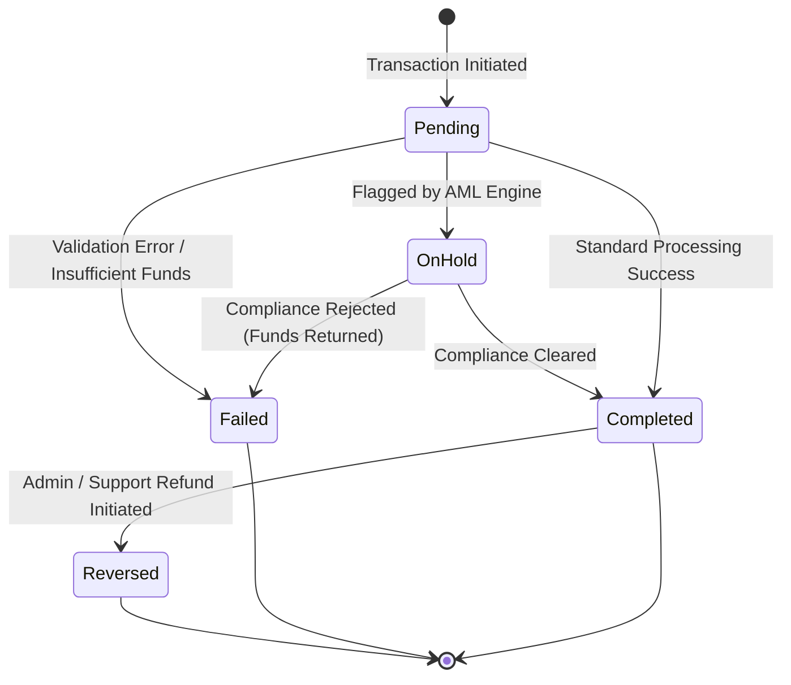
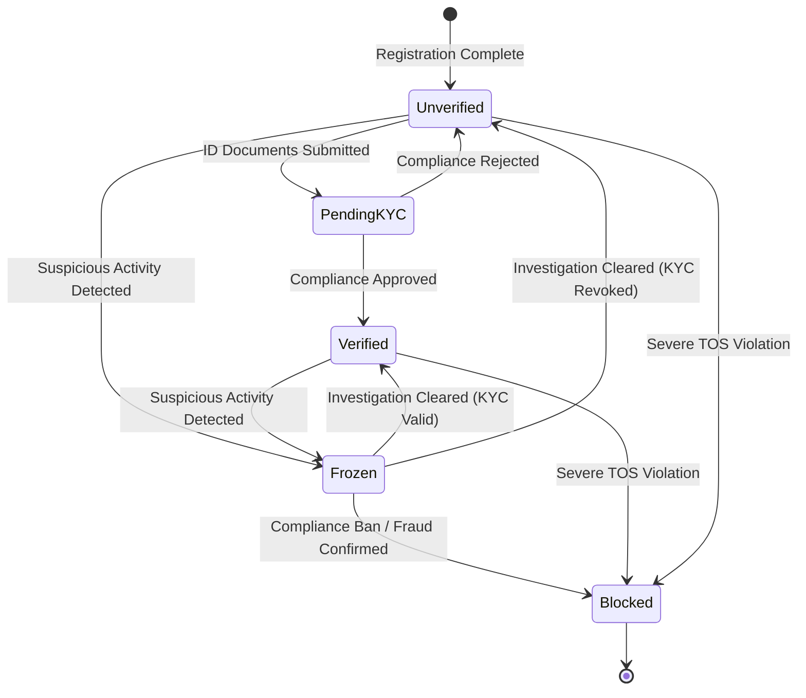
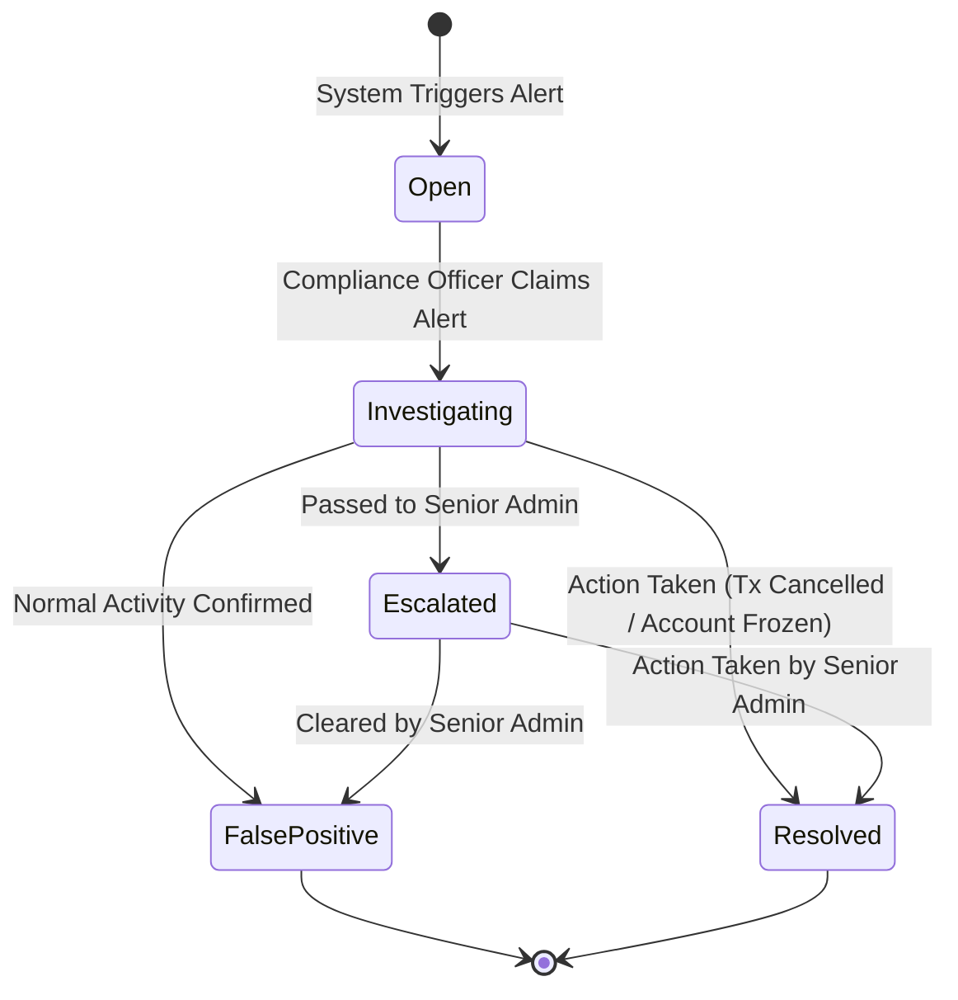
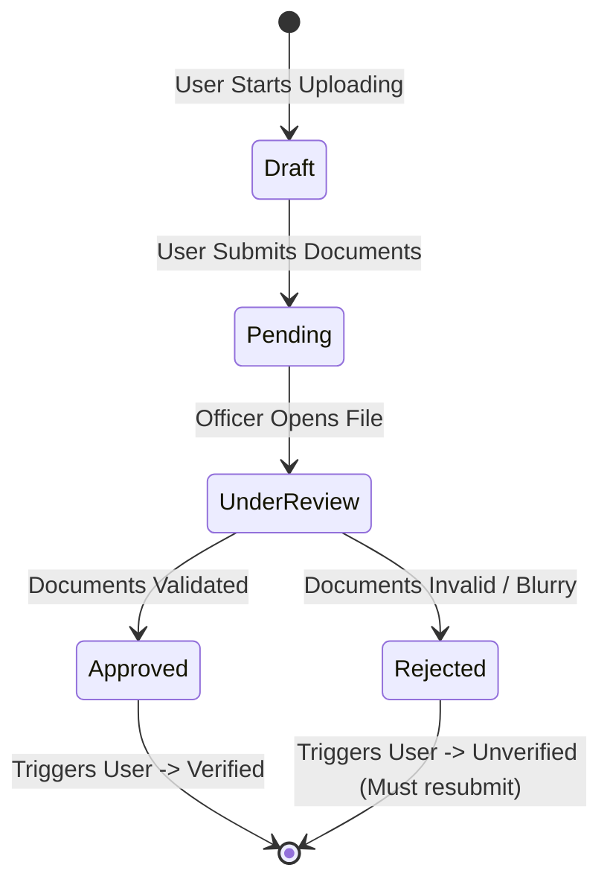
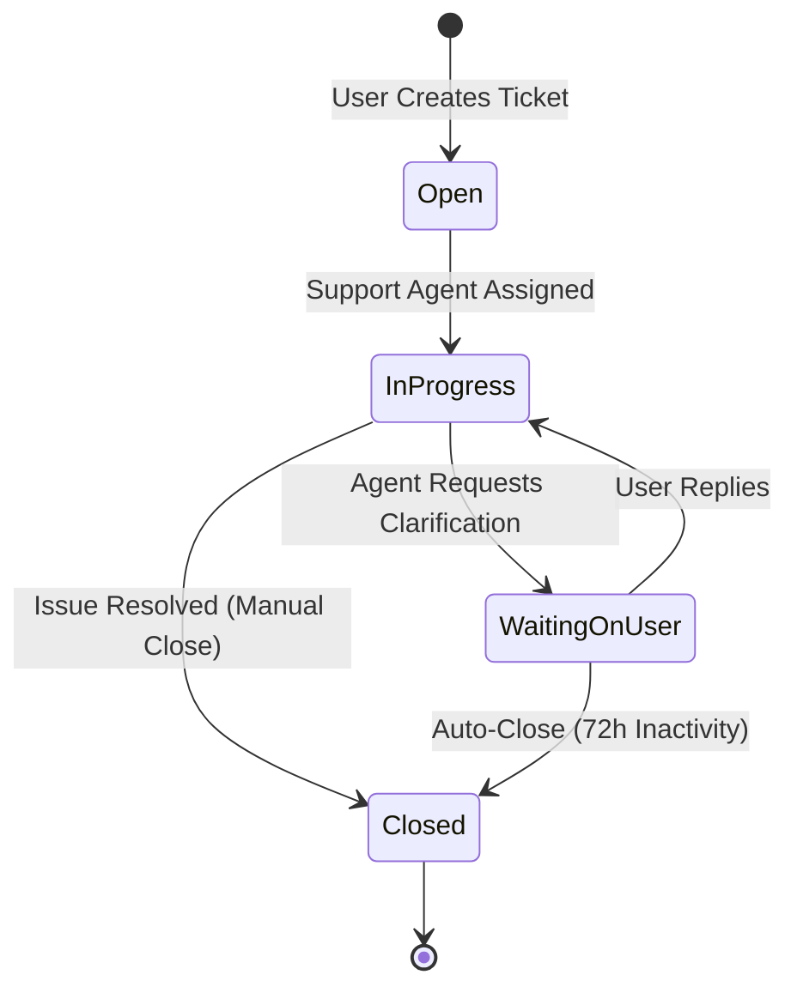

# PayCameroon State Machine Diagrams & Descriptions

This document illustrates the lifecycle and state transitions of the core entities within the PayCameroon system. It includes both the visual State Machine Diagrams (SMD) and their corresponding detailed descriptions.

## 1. Transaction State Machine

The Transaction State Machine tracks the lifecycle of every financial movement (P2P, Cash-in, Cash-out, Payments) from initiation to final settlement.

### Description
*   **Pending**: The initial state when a user submits a transfer. The system is actively validating balances, PINs, and routing data.
*   **OnHold**: If the AI threat detection engine spots an anomaly (e.g., high velocity, unusual location), the transaction enters this suspended state. Funds are locked but not settled.
*   **Completed**: The happy path. Funds have successfully moved from the sender's wallet (or external source) to the recipient's wallet, and fees have been deducted.
*   **Failed**: The transaction was aborted due to lack of funds, incorrect PIN, API timeout, or a definitive rejection by Compliance.
*   **Reversed**: A terminal state applied to a previously `Completed` transaction if an Admin or Support Rep issues a manual refund/chargeback.

---

## 2. User Account Lifecycle State Machine

This state machine defines a user's operational capabilities, determined by their KYC (Know Your Customer) compliance status and platform standing.

### Description
*   **Unverified**: The default starting state. The user has registered with a phone number and PIN but has strict transaction limits.
*   **PendingKYC**: The user has uploaded their ID and selfie. They await manual review. Limits remain restricted.
*   **Verified**: The user is fully compliant. Transaction limits are raised to standard thresholds.
*   **Frozen**: A temporary administrative lock. The user can log in but cannot move funds. Triggered automatically by high-risk AML alerts or manually by Support.
*   **Blocked**: A terminal state. The user is permanently banned from the platform due to confirmed fraud or severe Terms of Service violations. Login is disabled.

---

## 3. AML Alert State Machine

This state machine dictates the workflow for security flags generated by the system's AI heuristic engine.

### Description
*   **Open**: An anomaly was detected. The alert sits in the shared Compliance Queue awaiting triage.
*   **Investigating**: A specific Compliance Officer claims the ticket and is actively reviewing the user's ledger history and device footprint.
*   **Escalated**: The investigating officer requires higher clearance (e.g., to freeze a large corporate merchant) and assigns it to a Senior Admin.
*   **FalsePositive**: The investigation proves the activity was legitimate. The alert is closed, and any associated `OnHold` transactions are pushed to `Completed`.
*   **Resolved**: The investigation confirmed a threat. The officer took punitive action (e.g., reversing the transaction, freezing the account) and closed the alert.

---

## 4. KYC Application State Machine

This state machine handles the review process for a user's compliance documentation.

### Description
*   **Draft**: The user is mid-process (e.g., took a photo of the ID front, but hasn't uploaded the back yet).
*   **Pending**: The complete application is submitted and queued for the Compliance team.
*   **UnderReview**: A Compliance Officer locks the application to prevent duplicate reviews by other officers.
*   **Approved**: The documents are authentic and match the user profile. The parent User state is updated.
*   **Rejected**: The documents are forged, expired, or illegible. The user is notified to try again.

---

## 5. Support Ticket (PayChat) State Machine

This state machine governs the lifecycle of customer service inquiries.

### Description
*   **Open**: A new message is sent by the user via the PayChat module. The ticket hits the global support queue.
*   **InProgress**: An agent claims the ticket and begins actively messaging the user or investigating the database.
*   **WaitingOnUser**: The agent has asked a question (e.g., "Can you provide the exact date of the failed deposit?") and is waiting for a response. The SLA timer pauses.
*   **Closed**: The issue is resolved, or the system auto-closes the ticket due to user abandonment. No further messages can be sent in this thread.
