# PayCameroon Comprehensive Use Case Diagram

The following Mermaid diagram provides a complete mapping of all user personas (Actors) and the specific features (Use Cases) they interact with across the different platforms and dashboards in PayCameroon.

```mermaid
flowchart TB
    %% -------------------------
    %% ACTORS
    %% -------------------------
    U((Standard User))
    A((Agent))
    M((Merchant))
    SUP((Support Rep))
    COMP((Compliance Officer))
    FIN((Finance Admin))
    ADM((Super Admin))

    %% -------------------------
    %% COMMON FEATURES
    %% -------------------------
    subgraph Common Features
        C_Chat(PayChat / Support)
        C_Notif(View Notifications)
        C_Settings(Settings: Update Password & Language)
    end
    
    U --> C_Chat
    U --> C_Notif
    U --> C_Settings
    
    A --> C_Chat
    A --> C_Notif
    A --> C_Settings
    
    M --> C_Chat
    M --> C_Notif
    M --> C_Settings
    
    SUP --> C_Notif
    COMP --> C_Notif
    FIN --> C_Notif
    ADM --> C_Notif
    
    C_Chat -.->|Handled by| SUP

    %% -------------------------
    %% USER APP USE CASES
    %% -------------------------
    subgraph User Portal
        U_Auth(Register, Login & KYC)
        U_Transfer(Send & Request Money)
        U_Scan(Scan QR to Pay/Transfer)
        U_Deposit(Add Funds via MoMo/Bank)
        U_Withdraw(Withdraw via Agent/Merchant/MoMo)
        U_Store(Buy/Swap eSIM & Pay Bills)
        U_Compare(Compare MoMo Rates)
        U_State(View Statements & History)
    end
    
    U --> U_Auth
    U --> U_Transfer
    U --> U_Scan
    U --> U_Deposit
    U --> U_Withdraw
    U --> U_Store
    U --> U_Compare
    U --> U_State

    %% -------------------------
    %% AGENT DASHBOARD
    %% -------------------------
    subgraph Agent Dashboard
        A_CashIn(Process User Cash In)
        A_CashOut(Process User Cash Out)
        A_FloatReq(Request Float)
        A_FloatSend(Send Float to Merchants/Agents)
        A_Comm(View Agent Commissions)
        A_Hist(View Agent History)
    end
    
    A --> A_CashIn
    A --> A_CashOut
    A --> A_FloatReq
    A --> A_FloatSend
    A --> A_Comm
    A --> A_Hist

    %% -------------------------
    %% MERCHANT DASHBOARD
    %% -------------------------
    subgraph Merchant Dashboard
        M_Receive(Receive Payments)
        M_CashOut(Process User Cash Out)
        M_Analytics(View Revenue Analytics)
        M_Withdraw(Withdraw to Bank/MoMo)
        M_Comm(Track Merchant Commissions)
        M_Hist(View Merchant History)
    end
    
    M --> M_Receive
    M --> M_CashOut
    M --> M_Analytics
    M --> M_Withdraw
    M --> M_Comm
    M --> M_Hist

    %% -------------------------
    %% SUPPORT DASHBOARD
    %% -------------------------
    subgraph Support Dashboard
        S_Tickets(Manage Support Tickets / PayChat)
        S_Search(Search Users)
        S_View(View User Profiles/Tx)
    end
    
    SUP --> S_Tickets
    SUP --> S_Search
    SUP --> S_View

    %% -------------------------
    %% COMPLIANCE DASHBOARD
    %% -------------------------
    subgraph Compliance Dashboard
        C_KYC(Review KYC Applications)
        C_AML(Monitor & Resolve AML Alerts)
        C_Flagged(Review Flagged Tx)
        C_Users(Block/Unblock Accounts)
        C_Audit(View System Audit Logs)
    end
    
    COMP --> C_KYC
    COMP --> C_AML
    COMP --> C_Flagged
    COMP --> C_Users
    COMP --> C_Audit

    %% -------------------------
    %% FINANCE DASHBOARD
    %% -------------------------
    subgraph Finance Dashboard
        F_Rev(Monitor Platform Revenue)
        F_Treasury(Manage Treasury Wallets)
        F_Ledger(View Global General Ledger)
        F_ApprFloat(Approve Float Requests)
        F_ApprWithdraw(Approve Merchant Withdrawals)
        F_Fees(Configure Fees & Commissions)
        F_Report(Generate Financial Reports)
    end
    
    FIN --> F_Rev
    FIN --> F_Treasury
    FIN --> F_Ledger
    FIN --> F_ApprFloat
    FIN --> F_ApprWithdraw
    FIN --> F_Fees
    FIN --> F_Report

    %% -------------------------
    %% SUPER ADMIN DASHBOARD
    %% -------------------------
    subgraph Super Admin Dashboard
        AD_Config(Configure System Logo, Fees, Security Policies)
        AD_MonKYCAML(Monitor KYC/AML)
        AD_Appr(Monitor Approvals & Requests)
        AD_Rev(View Revenue Reports)
        AD_Stats(View Global System Stats)
        AD_Accts(Manage Treasury Bank Accounts)
        AD_Users(Manage All Users/Agents)
        AD_AI(View AI Threat Detection Logs)
        AD_Logs(View Global Tx Logs)
    end
    
    ADM --> AD_Config
    ADM --> AD_MonKYCAML
    ADM --> AD_Appr
    ADM --> AD_Rev
    ADM --> AD_Stats
    ADM --> AD_Accts
    ADM --> AD_Users
    ADM --> AD_AI
    ADM --> AD_Logs

    %% -------------------------
    %% RELATIONSHIPS / OVERLAPS
    %% -------------------------
    ADM -.->|Has Access| FIN
    ADM -.->|Has Access| COMP
    ADM -.->|Has Access| SUP
    
    A -.->|Has Wallet| U_State
    M -.->|Has Wallet| U_State
    
    U_Auth -.-> C_KYC
    A_FloatReq -.-> F_ApprFloat
    M_Withdraw -.-> F_ApprWithdraw
```

## Detailed Description of Actors & Roles

1. **Standard User**: The primary consumer using the application. They can transfer funds, pay bills, buy/swap eSIMs, compare exchange rates, deposit via Mobile Money/Card, cash out via agents/merchants, download statements, view notifications, update their password and language settings, and use **PayChat** to contact support.
2. **Agent**: A local representative acting as a cash-in and cash-out endpoint. Agents perform deposits/withdrawals for users, earn commissions, request float top-ups from the platform, send float to other agents or merchants, track their daily activity, view notifications, update their password and language settings, and use **PayChat** for support.
3. **Merchant**: A business entity receiving payments from users for goods and services. Merchants track their revenue analytics, earn commissions on specific integrations, request withdrawals to their bank or mobile money accounts, process user cash withdrawals, view notifications, update their password and language settings, and use **PayChat** for support.
4. **Support Representative**: Focused on customer service. They view and respond to **PayChat** messages and support tickets submitted by users, agents, and merchants. They can search user profiles and transaction histories to resolve issues, and view system notifications.
5. **Compliance Officer**: Responsible for regulatory adherence and security. They review and approve/reject user KYC submissions, investigate AI-generated AML (Anti-Money Laundering) alerts, review flagged transactions, block/unblock accounts, view audit logs, and view system notifications.
6. **Finance / Treasury Admin**: Controls the platform's monetary policies. They track platform revenue and internal treasury wallets, view the global general ledger, configure system-wide tax rates, cash-out fees, and commission percentages. They are also responsible for approving Agent float requests, Merchant withdrawal requests, and viewing system notifications.
7. **Super Admin**: Oversees the entire health and infrastructure of the platform. They can configure system branding (logo), transaction fees, agent/merchant commissions, and security policies. They monitor global approvals & requests, revenue reports, and KYC/AML operations. They also view global system statistics, manage treasury bank account mappings, manage all user/agent/merchant accounts, monitor AI threat detection logs, view raw global transaction logs, and view system notifications. They inherently have overlapping access to Finance, Compliance, and Support functions if needed.
